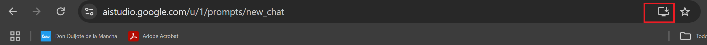

# 🔨 PWA aplicación web progresiva con IA. Servicio Soporte Remoto IT con IA (Windows y Chrome)
INSTALA una aplicación web progresiva PWA en un entorno windows.
Es un tipo de aplicación web que **combina lo mejor de las páginas web y las aplicaciones nativas**. Permiten el acceso parcial o total sin conexión a internet, mejorando la experiencia del usuario. Pueden enviar notificaciones personalizadas y geolocalizadas. Funcionan en un contexto seguro (HTTPS).

Para usar **AI Studio** como aplicación desvinculada del navegador  podemos instalarla desde WebCatalog.

Pero también si usamos Chrome podemos descargarla desde la propia web.

## Images




### Como instalar chrome en Debian
ntorno Linux. Requiere instalación de Chrome.
```
sudo apt update   # actualiza la lista de paquetes disponibles en los repositorios de tu sistema Linux, pero no instala ni actualiza ningún software
sudo apt upgrade  # instala las versiones disponibles
```
```
sudo wget --version  # miramos si tenemos wget instalado para descargar los paquetes
sudo apt install wget # instalamos wget para descargar los paquetes
wget https://dl.google.com/linux/direct/google-chrome-stable_current_amd64.deb  #descargamos una versión estable
```
```
sudo dpkg -i google-chrome-stable_current_amd64.deb   # con dpkg instalamos la herramienta de gestión de paquetes de bajo nivel en Debian
sudo apt-get install -f  # instalamos el paquete con solución de errores
```
```
google-chrome  #abrimos Chrome
```
Navegamos a la url e instalamos la PWA 
Podemos comprobar como disponemos de un link en Aplicaciones