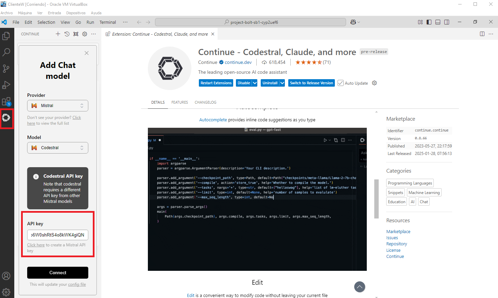

# 🔨  Integración Codestral en Visual Studio en Modo Copilot
Mistral acaba de facilitar el uso de Codestral Code a través de su API de manera ilimitada y gratuita.
La integración dentro del entorno de trabajo facilita la revisión de código y la creación del mismo.

Entramos en 
https://console.mistral.ai/codestral

Creamos la API codestral (no de mistral) y la copiamos.
* Desde Visual Studio Code , añadimos la extensión Continue, Instalamos.
* Seleccionamos como proveedor Mistral, modelo Codestral y añadimos la API.

 

## Images

