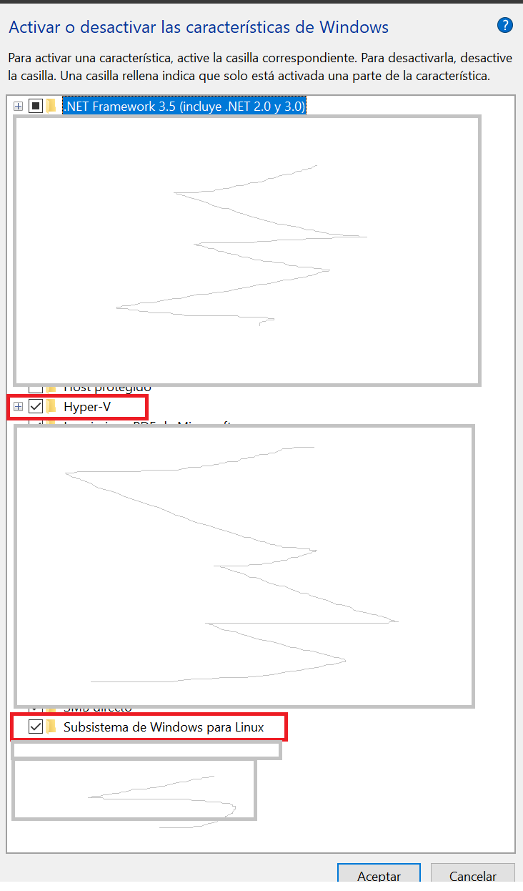
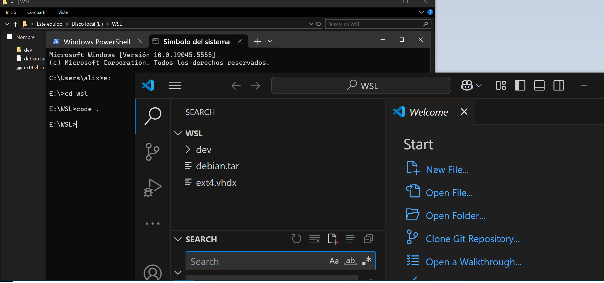
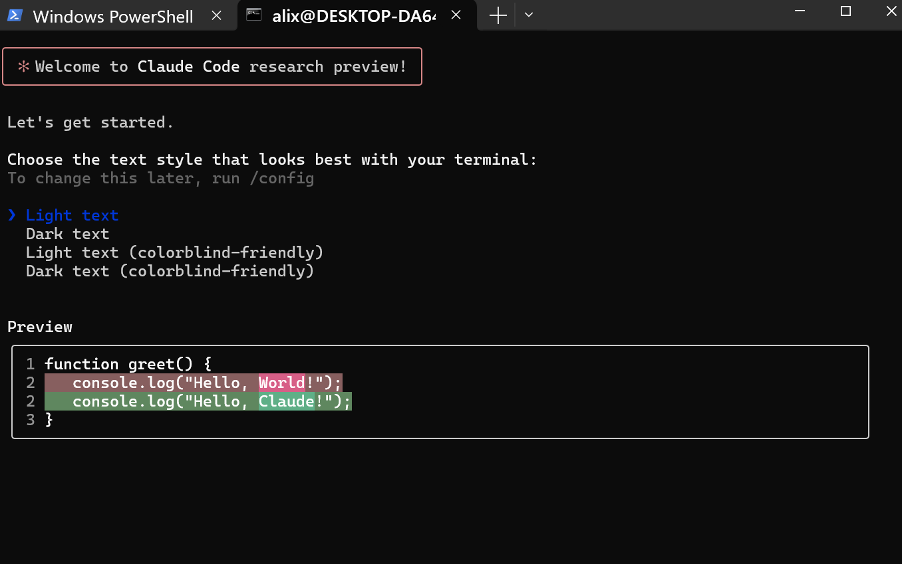
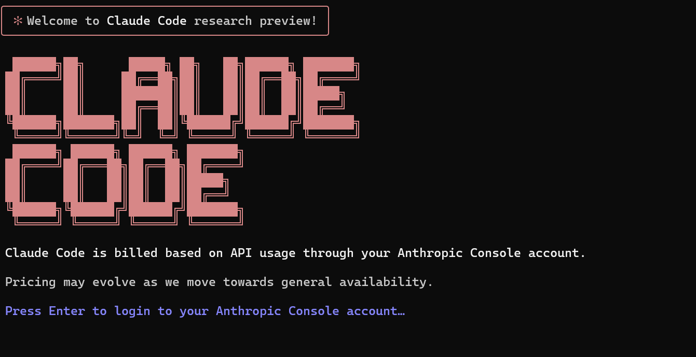
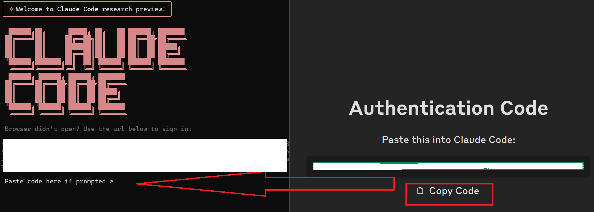
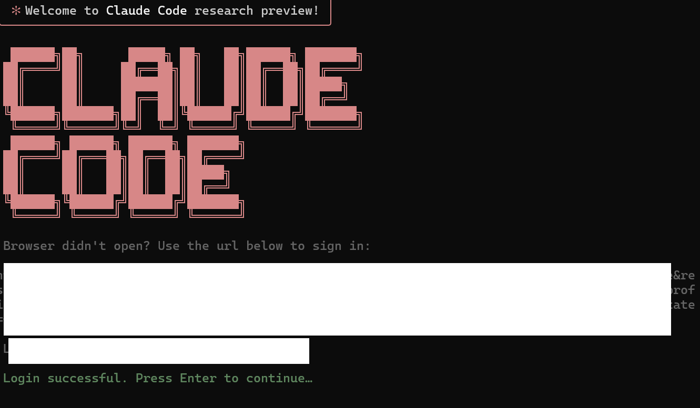

# 🔨  Instalar claude code con WSL2 en windows para entorno de desarrollo integrado con VS Code
Extraido de Newsletter IA-ismo: 
https://www.linkedin.com/pulse/instalar-claude-code-con-wsl2-en-windows-para-entorno-alicia-8bw3f

Como integrar Claude Code en el flujo de trabajo Windows.Necesitas arrancar tu distribucción con **WSL (Windows Subsystem Linux)**  que permite la instalación de sistemas operativos GNU/Linux en windows. 

* Requiere Windows 10 versión 2004 o posterior, o Windows 11

Previamente en : Activar o desactivar características para windows 

* Virtualización Hyper-V activada en la BIOS/UEFI
* Subsistema de windows para Linux

## Images


 
***Abrimos PowerShell como administrador***:
```
wsl --install  -d Debian
```

añadimos el nombre de usuario y contraseña que queramos

***(opcional) Si queremos mover la instalación a otro disco duro por ejemplo E***:
```
$ wsl --export Debian E:\WSL\debian.tar 
$ wsl --unregister Debian   
$ wsl --import Debian E:\WSL\ E:\WSL\debian.tar
```
Iniciamos WSL (recomendamos instalar windows terminal de Microsoft Store windows)
 

Nos aseguramos entrar con el usuario predeterminando
```
$ wsl config --default-user [nombre de usuario]
```
O podemos arrancar directamente
```
$ wsl -d Debian -u [nombre de usuario]
``` 


## INTEGRACIÓN CON VISUAL STUDIO CODE
Extensión WSL desde el marketplace de VS Code.

Nos situamos el la carpeta de nuestro proyecto donde vamos a trabajar con el entorno WSL : 
``` 
wt (de windows terminal)
``` 
Esto nos abre la terminal en la ruta de trabajo.
Dentro de la terminal podemos arrancar visual studio code escribiendo: 
code . 
O desde VS code, (Ctrl + Shift + P) seleccionando WSL.


## Images



## INSTALANDO NODE Y NPM
``` 
$ sudo apt-get update
$ sudo apt-get install curl
$ curl -o- https://raw.githubusercontent.com/nvm-sh/nvm/v0.39.0/install.sh | bash
$ nvm ls   (comprobamos que tenemos instalado)
$ nvm install --lts  (instalamos la versión LTS actual y estable)
$ nvm install node
$ npm --version
``` 

## INSTALANDO CLAUDE CODE
``` 
//Dependencias 

//git ******************************************************************************
$ sudo apt-get update
$ sudo apt-get install git
$ sudo add-apt-repository ppa:git-core/ppa | sudo apt update | sudo apt install git
$ git --version

//github **************************************************************************
(Para repositorio) 
$ sudo apt-get update

$ (type -p wget >/dev/null || (sudo apt update && sudo apt-get install wget -y)) \
	&& sudo mkdir -p -m 755 /etc/apt/keyrings \
        && out=$(mktemp) && wget -nv -O$out https://cli.github.com/packages/githubcli-archive-keyring.gpg \
        && cat $out | sudo tee /etc/apt/keyrings/githubcli-archive-keyring.gpg > /dev/null \
	&& sudo chmod go+r /etc/apt/keyrings/githubcli-archive-keyring.gpg \
	&& echo "deb [arch=$(dpkg --print-architecture) signed-by=/etc/apt/keyrings/githubcli-archive-keyring.gpg] https://cli.github.com/packages stable main" | sudo tee /etc/apt/sources.list.d/github-cli.list > /dev/null \
	&& sudo apt update \
	&& sudo apt install gh -y

$ sudo apt-get install gh

//ripreg **************************************************************************
(Para búsqueda mejorada de archivos)

$ curl -LO https://github.com/BurntSushi/ripgrep/releases/download/14.1.0/ripgrep_14.1.0-1_amd64.deb

$ sudo dpkg -i ripgrep_14.1.0-1_amd64.deb

$ sudo apt-get install ripgrep
``` 
``` 
$ npm install -g @anthropic-ai/claude-code

(OPCIONAL) solo si solicita  npm install -g npm@11.1.0-
Reinstalamos:
npm install -g npm@11.1.
npm install -g @anthropic-ai/claude-code ``` 
Arrancamos
``` 
//Entramos el el directorio de trabajo
cd dev
//Arrancamos
claude
``` 
Seleccionamos tipo de look (dark, light...)

## Images



Nos logueamos y copiamos el token


Requiere que actives facturación en la consola console.anthropic.com



Ejemplo de uso
``` 

# Ask questions about your codebase
$ claude
> how does our authentication system work?

# Create a commit with one command
$ claude commit

# Fix issues across multiple files
$ claude "fix the type errors in the auth module"

$ summarize this proyect

Crea un README.md /init
``` 
