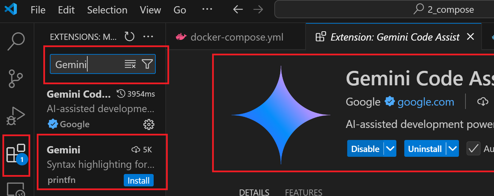
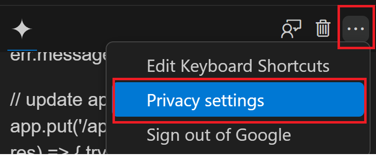
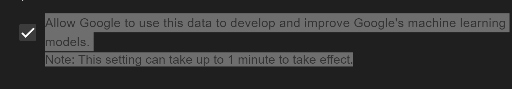
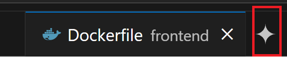
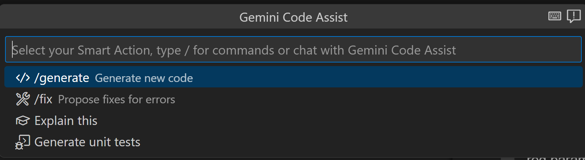

# 🔨  Integrando Gemini Code Assistant en tu IDE y GitHub: Guía rápida. 180.000 consultas al mes gratis.
Extraido de Newsletter IA-ismo: 
https://www.linkedin.com/pulse/integrando-gemini-code-assistant-en-tu-ide-y-github-alicia-ldrhf/
  

###  Instalación y configuración de la extensión Gemini Code en VS Code

1. Instala la extensión en VS Code: Abre tu IDE por ejemplo Visual Studio Code y ve a la pestaña de Extensiones (icono de cuadrados en la barra lateral o con el atajo Ctrl + Shift + X). En la barra de búsqueda, escribe “Gemini Code Assist”. Encuentra la extensión oficial de Google llamada Gemini Code Assist y haz clic en Install para agregarla.

 

## Images

 
Una vez instalada, verás un nuevo icono de Gemini (un diamante azul/violeta) en la barra lateral izquierda de VS Code.

2. Inicia sesión con Google: Haz clic en el icono de Gemini en VS Code (debajo del icono de Extensiones). Se abrirá un panel donde deberás autenticarte con tu cuenta de Google (requiere una cuenta Gmail personal, no necesitas tarjeta de crédito)

Este paso conecta la extensión con el servicio en la nube de Gemini Code Assist.

3. Configura tus preferencias: Tras iniciar sesión, la extensión puede mostrarte un aviso de privacidad. De forma predeterminada, Gemini Code Assist recopila algunos datos de uso anonimizados para mejorar los modelos de IA, pero tú puedes optar por desactivar esta telemetría en cualquier momento

Con (Ctrl + , para abrir Preferences > Settings) y busca “GeminiCodeAssist”. Allí encontrarás la opción geminicodeassist.enableTelemetry con una casilla que puedes desmarcar para no enviar datos de uso a Google

O desde el mismo chat en los tres puntitos de opciones 
## Images

En Privacy settings puedes desmarcar Allow Google to use this data to develop and improve Google's machine...

Esto asegura que solo tú controlas qué información se comparte.

Nota: La extensión no va a modificar tu entorno ni instalar dependencias por sí sola. Solo realiza acciones cuando tú se las pides. Por ejemplo, si Gemini sugiere código que requiere un paquete npm, no lo instalará automáticamente – eres tú quien decides instalarlo o no. Del mismo modo, la extensión no “arranca” sola al abrir VS Code más allá de cargar su icono; no consumirá recursos ni enviará código a Google a menos que tú interactúes con ella. Esta filosofía es distinta de otras integraciones de IA y mantiene al desarrollador al mando de la situación en todo momento.

## ¿Cómo interactuar con Gemini dentro de VS Code?
Directamente desde el editor de código: Barra Quick Pick , accedes a ella escribiendo Ctrl + I en windows o CMD+ I en Mac, o en el icono de gemini en la parte superior donde puedes cerrar los archivos.

Esto abrirá la barra de comandos embebida en VS Code. Aquí podemos escribir directamente el comando y el prompt 

Por ejemplo:

* /explain para que Gemini explique qué hace el bloque de código actual en el que estás trabajando,
* /generate seguido de una descripción, para generar un bloque de código. 

  Ej: /generate función que lea un JSON de una URL.

* /fix para que Gemini sugiera una corrección o mejora en el código.

 Por ejemplo, **si quieres que comente mejor tu función**, podrías escribir /fix add detailed comments to all methods. Al ejecutar este comando, verás un diff con los cambios propuestos (como nuevos comentarios en tu código) para que los revises y aceptes o rechaces antes de aplicarlos. 

Con (Ctrl + Shift + P) y buscar “Gemini” verás otras acciones disponibles de la extensión!

## OTRAS INTEGRACIONES 
Dentro de VS Studio Code

* Autocompletado inteligente: al igual que Copilot a medida que escribes sugiere líneas o bloques de codigo que apareceran en gris italic justo en tu editor. Puedes aceptar las sugerencias con TAB o ignorarlas.
* Chat de Asistencia. Al hacer clic en el icono de Gemini en la barra lateral, se abre un panel de chat. Aquí puedes hacer preguntas en lenguaje natural (“¿Cómo puedo ordenar una lista en Python?”) y obtener respuestas con ejemplos de código y hasta referencias a la documentación relevante. 

En Github
* Integración opcional en GitHub: En entornos colaborativos, puedes integrar Gemini con GitHub para ayudar en code reviews,   pero incluso allí, no se fusiona nada automáticamente. 

Al crear un Pull Request, Gemini genera en unos minutos un resumen descriptivo de los cambios y lo publica como comentario en la conversación del PR.

Gemini puede proponer cambios concretos. Sus comentarios a menudo vienen con un parche sugerido (pull request suggestions) que puedes aplicar con un clic.

https://github.com/apps/gemini-code-assist